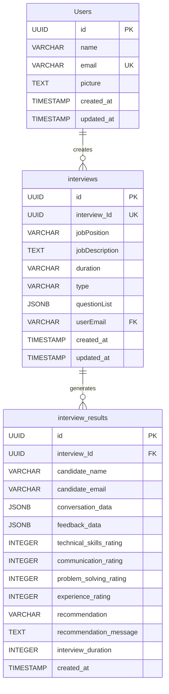
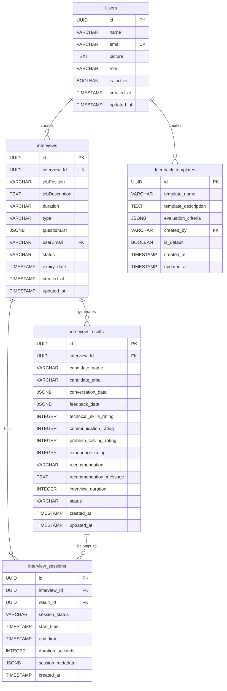

# Vivecruit - Entity Relationship Diagram (ERD)
## Comprehensive Database Design Documentation

---

## Table of Contents
1. [ERD Overview](#erd-overview)
2. [Entity Definitions](#entity-definitions)
3. [Relationship Analysis](#relationship-analysis)
4. [Attribute Specifications](#attribute-specifications)
5. [Database Schema](#database-schema)
6. [Normalization Analysis](#normalization-analysis)
7. [Indexing Strategy](#indexing-strategy)
8. [Constraints & Rules](#constraints--rules)
9. [Data Integrity](#data-integrity)
10. [Performance Considerations](#performance-considerations)

---

## ERD Overview

### High-Level Entity Relationship Diagram


### Extended ERD with Additional Entities


---

## Entity Definitions

### 1. Users Entity
**Purpose**: Stores user account information and authentication data
**Primary Key**: `id` (UUID)
**Unique Constraints**: `email`

**Description**: 
The Users entity represents all registered users of the Vivecruit platform, including recruiters, HR professionals, and administrators. Each user has a unique email address and can create multiple interviews.

**Business Rules**:
- Email addresses must be unique across the system
- Users are automatically created upon successful Google OAuth authentication
- User profiles can be updated but email addresses cannot be changed
- Inactive users are marked but not deleted for audit purposes

### 2. Interviews Entity
**Purpose**: Stores interview configurations and metadata
**Primary Key**: `id` (UUID)
**Unique Constraints**: `interview_Id`

**Description**:
The Interviews entity contains all information needed to conduct an AI-powered interview, including job details, question sets, and configuration parameters. Each interview is created by a user and can be accessed by multiple candidates.

**Business Rules**:
- Each interview has a unique identifier for secure link sharing
- Interview questions are stored as JSONB for flexibility
- Interviews have an expiry date for security
- Interview status tracks whether it's active, completed, or expired

### 3. Interview_Results Entity
**Purpose**: Stores candidate interview results and feedback
**Primary Key**: `id` (UUID)
**Foreign Keys**: `interview_Id` → `interviews.interview_Id`

**Description**:
The Interview_Results entity captures the complete outcome of each candidate's interview, including conversation data, AI-generated feedback, and numerical ratings across multiple dimensions.

**Business Rules**:
- Each result is linked to a specific interview
- Ratings are on a scale of 1-10
- Conversation data is stored as JSONB for detailed analysis
- Results cannot be modified once created (immutable for audit purposes)

### 4. Interview_Sessions Entity (Proposed)
**Purpose**: Tracks individual interview sessions and metadata
**Primary Key**: `id` (UUID)
**Foreign Keys**: `interview_Id` → `interviews.interview_Id`, `result_id` → `interview_results.id`

**Description**:
The Interview_Sessions entity provides detailed tracking of each interview session, including timing, status, and session-specific metadata. This enables better analytics and troubleshooting.

**Business Rules**:
- Each session is linked to both an interview and a result
- Session status tracks the complete lifecycle
- Duration is calculated in seconds for precise timing
- Session metadata includes technical details for debugging

### 5. Feedback_Templates Entity (Proposed)
**Purpose**: Stores reusable feedback evaluation templates
**Primary Key**: `id` (UUID)
**Foreign Keys**: `created_by` → `Users.email`

**Description**:
The Feedback_Templates entity allows users to create and reuse standardized evaluation criteria for different types of interviews, ensuring consistency in candidate assessment.

**Business Rules**:
- Templates can be created by any user
- Default templates are available for common interview types
- Evaluation criteria are stored as JSONB for flexibility
- Templates can be shared across the organization

---

## Relationship Analysis

### 1. Users to Interviews (1:N)
**Relationship Type**: One-to-Many
**Cardinality**: One user can create many interviews
**Foreign Key**: `interviews.userEmail` → `Users.email`

**Business Logic**:
- A recruiter can create multiple interviews for different positions
- Each interview is owned by exactly one user
- User deletion affects interview ownership (cascade or restrict based on business rules)

**Constraints**:
- Foreign key constraint ensures referential integrity
- User must exist before interview can be created
- Interview ownership cannot be null

### 2. Interviews to Interview_Results (1:N)
**Relationship Type**: One-to-Many
**Cardinality**: One interview can have many results (multiple candidates)
**Foreign Key**: `interview_results.interview_Id` → `interviews.interview_Id`

**Business Logic**:
- A single interview template can be used by multiple candidates
- Each candidate's result is unique and linked to the specific interview
- Interview deletion affects all associated results

**Constraints**:
- Foreign key constraint ensures referential integrity
- Interview must exist before results can be created
- Results are immutable once created

### 3. Interviews to Interview_Sessions (1:N)
**Relationship Type**: One-to-Many
**Cardinality**: One interview can have multiple sessions
**Foreign Key**: `interview_sessions.interview_Id` → `interviews.interview_Id`

**Business Logic**:
- Each interview attempt creates a new session
- Sessions track the complete interview lifecycle
- Multiple sessions may occur for the same interview (retries, technical issues)

**Constraints**:
- Foreign key constraint ensures referential integrity
- Session timing data is required for analytics

### 4. Interview_Results to Interview_Sessions (1:1)
**Relationship Type**: One-to-One
**Cardinality**: Each result corresponds to exactly one session
**Foreign Key**: `interview_sessions.result_id` → `interview_results.id`

**Business Logic**:
- Each completed interview session produces one result
- Session data provides context for result analysis
- Failed sessions may not produce results

**Constraints**:
- Foreign key constraint ensures referential integrity
- Session must exist before result can be created

---

## Attribute Specifications

### Users Entity Attributes

| Attribute | Type | Size | Nullable | Default | Description |
|-----------|------|------|----------|---------|-------------|
| id | UUID | - | NO | gen_random_uuid() | Primary key |
| name | VARCHAR | 255 | NO | - | User's full name |
| email | VARCHAR | 255 | NO | - | Unique email address |
| picture | TEXT | - | YES | NULL | Profile picture URL |
| role | VARCHAR | 50 | YES | 'user' | User role (user, admin) |
| is_active | BOOLEAN | - | NO | true | Account status |
| created_at | TIMESTAMP | - | NO | NOW() | Creation timestamp |
| updated_at | TIMESTAMP | - | NO | NOW() | Last update timestamp |

### Interviews Entity Attributes

| Attribute | Type | Size | Nullable | Default | Description |
|-----------|------|------|----------|---------|-------------|
| id | UUID | - | NO | gen_random_uuid() | Primary key |
| interview_Id | UUID | - | NO | gen_random_uuid() | Unique interview identifier |
| jobPosition | VARCHAR | 255 | NO | - | Job title/position |
| jobDescription | TEXT | - | NO | - | Detailed job description |
| duration | VARCHAR | 100 | NO | - | Interview duration |
| type | VARCHAR | 100 | NO | - | Interview type |
| questionList | JSONB | - | NO | - | Generated questions |
| userEmail | VARCHAR | 255 | NO | - | Creator's email (FK) |
| status | VARCHAR | 50 | NO | 'active' | Interview status |
| expiry_date | TIMESTAMP | - | YES | NULL | Expiration date |
| created_at | TIMESTAMP | - | NO | NOW() | Creation timestamp |
| updated_at | TIMESTAMP | - | NO | NOW() | Last update timestamp |

### Interview_Results Entity Attributes

| Attribute | Type | Size | Nullable | Default | Description |
|-----------|------|------|----------|---------|-------------|
| id | UUID | - | NO | gen_random_uuid() | Primary key |
| interview_Id | UUID | - | NO | - | Interview reference (FK) |
| candidate_name | VARCHAR | 255 | NO | - | Candidate's full name |
| candidate_email | VARCHAR | 255 | NO | - | Candidate's email |
| conversation_data | JSONB | - | YES | NULL | Interview conversation |
| feedback_data | JSONB | - | YES | NULL | AI-generated feedback |
| technical_skills_rating | INTEGER | - | YES | NULL | Technical skills score (1-10) |
| communication_rating | INTEGER | - | YES | NULL | Communication score (1-10) |
| problem_solving_rating | INTEGER | - | YES | NULL | Problem solving score (1-10) |
| experience_rating | INTEGER | - | YES | NULL | Experience score (1-10) |
| recommendation | VARCHAR | 50 | YES | NULL | Hire recommendation |
| recommendation_message | TEXT | - | YES | NULL | Detailed recommendation |
| interview_duration | INTEGER | - | YES | NULL | Duration in seconds |
| status | VARCHAR | 50 | NO | 'completed' | Result status |
| created_at | TIMESTAMP | - | NO | NOW() | Creation timestamp |
| updated_at | TIMESTAMP | - | NO | NOW() | Last update timestamp |

---

## Database Schema

### Current Schema (Supabase/PostgreSQL)

```sql
-- Users table
CREATE TABLE Users (
    id UUID PRIMARY KEY DEFAULT gen_random_uuid(),
    name VARCHAR(255) NOT NULL,
    email VARCHAR(255) UNIQUE NOT NULL,
    picture TEXT,
    role VARCHAR(50) DEFAULT 'user',
    is_active BOOLEAN DEFAULT true,
    created_at TIMESTAMP DEFAULT NOW(),
    updated_at TIMESTAMP DEFAULT NOW()
);

-- Interviews table
CREATE TABLE interviews (
    id UUID PRIMARY KEY DEFAULT gen_random_uuid(),
    interview_Id UUID UNIQUE NOT NULL DEFAULT gen_random_uuid(),
    jobPosition VARCHAR(255) NOT NULL,
    jobDescription TEXT NOT NULL,
    duration VARCHAR(100) NOT NULL,
    type VARCHAR(100) NOT NULL,
    questionList JSONB NOT NULL,
    userEmail VARCHAR(255) NOT NULL,
    status VARCHAR(50) DEFAULT 'active',
    expiry_date TIMESTAMP,
    created_at TIMESTAMP DEFAULT NOW(),
    updated_at TIMESTAMP DEFAULT NOW(),
    FOREIGN KEY (userEmail) REFERENCES Users(email)
);

-- Interview Results table
CREATE TABLE interview_results (
    id UUID PRIMARY KEY DEFAULT gen_random_uuid(),
    interview_Id UUID NOT NULL,
    candidate_name VARCHAR(255) NOT NULL,
    candidate_email VARCHAR(255) NOT NULL,
    conversation_data JSONB,
    feedback_data JSONB,
    technical_skills_rating INTEGER CHECK (technical_skills_rating >= 1 AND technical_skills_rating <= 10),
    communication_rating INTEGER CHECK (communication_rating >= 1 AND communication_rating <= 10),
    problem_solving_rating INTEGER CHECK (problem_solving_rating >= 1 AND problem_solving_rating <= 10),
    experience_rating INTEGER CHECK (experience_rating >= 1 AND experience_rating <= 10),
    recommendation VARCHAR(50),
    recommendation_message TEXT,
    interview_duration INTEGER,
    status VARCHAR(50) DEFAULT 'completed',
    created_at TIMESTAMP DEFAULT NOW(),
    updated_at TIMESTAMP DEFAULT NOW(),
    FOREIGN KEY (interview_Id) REFERENCES interviews(interview_Id)
);

-- Indexes for performance
CREATE INDEX idx_interviews_user_email ON interviews(userEmail);
CREATE INDEX idx_interviews_status ON interviews(status);
CREATE INDEX idx_interviews_created_at ON interviews(created_at);
CREATE INDEX idx_interview_results_interview_id ON interview_results(interview_Id);
CREATE INDEX idx_interview_results_candidate_email ON interview_results(candidate_email);
CREATE INDEX idx_interview_results_created_at ON interview_results(created_at);

-- Triggers for updated_at timestamps
CREATE OR REPLACE FUNCTION update_updated_at_column()
RETURNS TRIGGER AS $$
BEGIN
    NEW.updated_at = NOW();
    RETURN NEW;
END;
$$ language 'plpgsql';

CREATE TRIGGER update_users_updated_at BEFORE UPDATE ON Users
    FOR EACH ROW EXECUTE FUNCTION update_updated_at_column();

CREATE TRIGGER update_interviews_updated_at BEFORE UPDATE ON interviews
    FOR EACH ROW EXECUTE FUNCTION update_updated_at_column();

CREATE TRIGGER update_interview_results_updated_at BEFORE UPDATE ON interview_results
    FOR EACH ROW EXECUTE FUNCTION update_updated_at_column();
```

---

## Normalization Analysis

### Current Normalization Level: 3NF (Third Normal Form)

**First Normal Form (1NF)**:
- All attributes contain atomic values
- No repeating groups or arrays (except JSONB which is intentional)
- Primary keys are properly defined

**Second Normal Form (2NF)**:
- All non-key attributes are fully dependent on the primary key
- No partial dependencies exist
- Foreign key relationships are properly established

**Third Normal Form (3NF)**:
- No transitive dependencies exist
- All attributes depend only on the primary key
- Normalized structure reduces data redundancy

**Denormalization Considerations**:
- JSONB fields (`questionList`, `conversation_data`, `feedback_data`) are intentionally denormalized for performance
- These fields contain structured data that is frequently accessed together
- JSONB provides flexibility for evolving data structures

---

## Indexing Strategy

### Primary Indexes
- **Users.id**: Primary key index (automatic)
- **interviews.id**: Primary key index (automatic)
- **interview_results.id**: Primary key index (automatic)

### Secondary Indexes
- **Users.email**: Unique index for authentication lookups
- **interviews.interview_Id**: Unique index for secure link access
- **interviews.userEmail**: Foreign key index for user relationship queries
- **interviews.status**: Index for filtering active/expired interviews
- **interviews.created_at**: Index for chronological queries
- **interview_results.interview_Id**: Foreign key index for relationship queries
- **interview_results.candidate_email**: Index for candidate lookups
- **interview_results.created_at**: Index for chronological queries

### Composite Indexes (Proposed)
```sql
-- For dashboard queries
CREATE INDEX idx_interviews_user_status_created ON interviews(userEmail, status, created_at);

-- For analytics queries
CREATE INDEX idx_results_interview_ratings ON interview_results(interview_Id, technical_skills_rating, communication_rating);

-- For candidate history
CREATE INDEX idx_results_candidate_created ON interview_results(candidate_email, created_at);
```

### JSONB Indexes (Proposed)
```sql
-- For question type queries
CREATE INDEX idx_interviews_question_type ON interviews USING GIN ((questionList->>'type'));

-- For feedback rating queries
CREATE INDEX idx_results_feedback_ratings ON interview_results USING GIN (feedback_data);
```

---

## Constraints & Rules

### Primary Key Constraints
- All entities have UUID primary keys
- Primary keys are auto-generated using `gen_random_uuid()`
- Primary keys are immutable once created

### Foreign Key Constraints
```sql
-- Users to Interviews
ALTER TABLE interviews 
ADD CONSTRAINT fk_interviews_user 
FOREIGN KEY (userEmail) REFERENCES Users(email);

-- Interviews to Results
ALTER TABLE interview_results 
ADD CONSTRAINT fk_results_interview 
FOREIGN KEY (interview_Id) REFERENCES interviews(interview_Id);
```

### Check Constraints
```sql
-- Rating validation
ALTER TABLE interview_results 
ADD CONSTRAINT chk_ratings_range 
CHECK (
    technical_skills_rating >= 1 AND technical_skills_rating <= 10 AND
    communication_rating >= 1 AND communication_rating <= 10 AND
    problem_solving_rating >= 1 AND problem_solving_rating <= 10 AND
    experience_rating >= 1 AND experience_rating <= 10
);

-- Status validation
ALTER TABLE interviews 
ADD CONSTRAINT chk_interview_status 
CHECK (status IN ('active', 'completed', 'expired', 'cancelled'));

ALTER TABLE interview_results 
ADD CONSTRAINT chk_result_status 
CHECK (status IN ('completed', 'failed', 'cancelled'));
```

### Unique Constraints
```sql
-- Email uniqueness
ALTER TABLE Users ADD CONSTRAINT uk_users_email UNIQUE (email);

-- Interview ID uniqueness
ALTER TABLE interviews ADD CONSTRAINT uk_interviews_interview_id UNIQUE (interview_Id);
```

---

## Data Integrity

### Referential Integrity
- Foreign key constraints ensure data consistency
- Cascade rules prevent orphaned records
- Deletion policies are clearly defined

### Domain Integrity
- Data types are appropriately chosen
- Check constraints validate business rules
- Default values ensure data completeness

### Entity Integrity
- Primary keys are unique and non-null
- Auto-incrementing UUIDs prevent conflicts
- Timestamps track data lifecycle

### Business Rule Enforcement
- Rating scales are enforced (1-10)
- Status values are restricted to valid options
- Email formats are validated
- Interview expiry dates are enforced

---

## Performance Considerations

### Query Optimization
- Indexes are created for frequently queried columns
- Composite indexes support complex queries
- JSONB indexes enable efficient JSON queries

### Storage Optimization
- UUIDs are used for distributed systems compatibility
- JSONB provides efficient storage for flexible data
- Timestamps use appropriate precision

### Scalability Considerations
- Database design supports horizontal scaling
- Indexes are optimized for read-heavy workloads
- Partitioning strategies can be implemented for large datasets

### Monitoring & Maintenance
- Regular index maintenance is required
- Query performance should be monitored
- Database statistics should be updated regularly

---

*This ERD documentation provides a comprehensive view of the database design for the Vivecruit system and should be updated as the schema evolves.*
