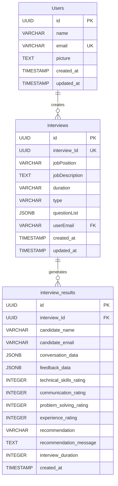

# Vivecruit - AI-Powered Recruitment Platform
## Professional Documentation

---

## Table of Contents
1. [Project Overview](#project-overview)
2. [System Architecture](#system-architecture)
3. [Technology Stack](#technology-stack)
4. [Database Schema](#database-schema)
5. [API Documentation](#api-documentation)
6. [User Workflows](#user-workflows)
7. [Data Flow Diagrams](#data-flow-diagrams)
8. [Entity Relationship Diagram](#entity-relationship-diagram)
9. [Security & Authentication](#security--authentication)
10. [Deployment & Environment](#deployment--environment)
11. [Performance & Scalability](#performance--scalability)
12. [Testing Strategy](#testing-strategy)
13. [Maintenance & Support](#maintenance--support)

---

## Project Overview

### Vision & Mission
Vivecruit is an AI-powered recruitment platform that revolutionizes the hiring process by providing automated, intelligent interview experiences. The platform leverages advanced AI technologies to conduct real-time voice interviews, generate personalized questions, and provide comprehensive candidate evaluations.

### Key Features
- **AI-Powered Voice Interviews**: Real-time voice conversations using VAPI.ai
- **Intelligent Question Generation**: Dynamic question creation based on job requirements
- **Automated Feedback System**: AI-generated candidate evaluations and ratings
- **Secure Interview Links**: Shareable interview URLs with candidate authentication
- **Real-time Analytics**: Live interview monitoring and progress tracking
- **Multi-format Interviews**: Support for various interview types (Technical, Behavioral, etc.)

### Target Users
- **Recruiters & HR Professionals**: Primary users creating and managing interviews
- **Candidates**: End users participating in AI interviews
- **Hiring Managers**: Stakeholders reviewing interview results and feedback

---

## System Architecture

### High-Level Architecture
```
┌─────────────────┐    ┌─────────────────┐    ┌─────────────────┐
│   Frontend      │    │   Backend       │    │   External      │
│   (Next.js)     │◄──►│   (Next.js API) │◄──►│   Services      │
└─────────────────┘    └─────────────────┘    └─────────────────┘
         │                       │                       │
         │                       │                       │
         ▼                       ▼                       ▼
┌─────────────────┐    ┌─────────────────┐    ┌─────────────────┐
│   Supabase      │    │   VAPI.ai       │    │   OpenAI        │
│   (Database)    │    │   (Voice AI)    │    │   (AI Models)   │
└─────────────────┘    └─────────────────┘    └─────────────────┘
```

### Component Architecture
```
┌─────────────────────────────────────────────────────────────┐
│                    Presentation Layer                       │
├─────────────────────────────────────────────────────────────┤
│ • Next.js Pages & Components                                │
│ • React Context Providers                                   │
│ • UI Components (shadcn/ui)                                 │
│ • Responsive Design (Tailwind CSS)                         │
└─────────────────────────────────────────────────────────────┘
                                │
┌─────────────────────────────────────────────────────────────┐
│                    Application Layer                        │
├─────────────────────────────────────────────────────────────┤
│ • API Routes (/api/*)                                       │
│ • Business Logic                                            │
│ • State Management                                          │
│ • Authentication Logic                                      │
└─────────────────────────────────────────────────────────────┘
                                │
┌─────────────────────────────────────────────────────────────┐
│                    Data Layer                               │
├─────────────────────────────────────────────────────────────┤
│ • Supabase Client                                           │
│ • Database Operations                                       │
│ • External API Integrations                                 │
│ • File Storage                                              │
└─────────────────────────────────────────────────────────────┘
```

---

## Technology Stack

### Frontend Technologies
- **Framework**: Next.js 15.4.5 (React 18.2.0)
- **Styling**: Tailwind CSS 4.0
- **UI Components**: shadcn/ui (Radix UI)
- **Icons**: Lucide React
- **Animations**: Framer Motion
- **State Management**: React Context API
- **Routing**: Next.js App Router

### Backend Technologies
- **Runtime**: Node.js (Next.js API Routes)
- **Database**: Supabase (PostgreSQL)
- **Authentication**: Supabase Auth (Google OAuth)
- **File Storage**: Supabase Storage

### External Services
- **Voice AI**: VAPI.ai (@vapi-ai/web)
- **AI Models**: OpenAI (via OpenRouter.ai)
- **Voice Synthesis**: ElevenLabs
- **Deployment**: Vercel

### Development Tools
- **Package Manager**: npm
- **Code Quality**: ESLint
- **Version Control**: Git
- **Environment**: Environment Variables (.env)

---

## Database Schema

### Core Tables

#### 1. Users Table
```sql
CREATE TABLE Users (
    id UUID PRIMARY KEY DEFAULT gen_random_uuid(),
    name VARCHAR(255) NOT NULL,
    email VARCHAR(255) UNIQUE NOT NULL,
    picture TEXT,
    created_at TIMESTAMP DEFAULT NOW(),
    updated_at TIMESTAMP DEFAULT NOW()
);
```

#### 2. Interviews Table
```sql
CREATE TABLE interviews (
    id UUID PRIMARY KEY DEFAULT gen_random_uuid(),
    interview_Id UUID UNIQUE NOT NULL,
    jobPosition VARCHAR(255) NOT NULL,
    jobDescription TEXT NOT NULL,
    duration VARCHAR(100) NOT NULL,
    type VARCHAR(100) NOT NULL,
    questionList JSONB NOT NULL,
    userEmail VARCHAR(255) NOT NULL,
    created_at TIMESTAMP DEFAULT NOW(),
    updated_at TIMESTAMP DEFAULT NOW(),
    FOREIGN KEY (userEmail) REFERENCES Users(email)
);
```

#### 3. Interview_Results Table (Proposed)
```sql
CREATE TABLE interview_results (
    id UUID PRIMARY KEY DEFAULT gen_random_uuid(),
    interview_Id UUID NOT NULL,
    candidate_name VARCHAR(255) NOT NULL,
    candidate_email VARCHAR(255) NOT NULL,
    conversation_data JSONB,
    feedback_data JSONB,
    technical_skills_rating INTEGER,
    communication_rating INTEGER,
    problem_solving_rating INTEGER,
    experience_rating INTEGER,
    recommendation VARCHAR(50),
    recommendation_message TEXT,
    interview_duration INTEGER,
    created_at TIMESTAMP DEFAULT NOW(),
    FOREIGN KEY (interview_Id) REFERENCES interviews(interview_Id)
);
```

---

## API Documentation

### 1. AI Model API (`/api/ai-model`)
**Purpose**: Generate interview questions based on job requirements

**Method**: POST

**Request Body**:
```json
{
  "jobPosition": "string",
  "jobDescription": "string", 
  "duration": "string",
  "type": "string"
}
```

**Response**:
```json
{
  "content": "string (JSON formatted questions)"
}
```

### 2. AI Feedback API (`/api/ai-feedback`)
**Purpose**: Generate candidate feedback based on interview conversation

**Method**: POST

**Request Body**:
```json
{
  "conversation": "object (interview conversation data)"
}
```

**Response**:
```json
{
  "content": "string (JSON formatted feedback)"
}
```

---

## User Workflows

### 1. Recruiter Workflow
```
1. Authentication (Google OAuth)
   ↓
2. Dashboard Access
   ↓
3. Create Interview
   ├── Enter Job Details
   ├── Select Interview Type
   └── Set Duration
   ↓
4. AI Generates Questions
   ↓
5. Review & Save Interview
   ↓
6. Share Interview Link
   ↓
7. Monitor Interview Progress
   ↓
8. Review Candidate Feedback
```

### 2. Candidate Workflow
```
1. Receive Interview Link
   ↓
2. Enter Personal Details
   ├── Full Name
   └── Email Address
   ↓
3. Validate Interview Link
   ↓
4. Join Interview Room
   ↓
5. Start Voice Interview
   ├── AI Introduction
   ├── Question & Answer Session
   └── Real-time Interaction
   ↓
6. Complete Interview
   ↓
7. Receive Confirmation
```

### 3. Interview Process Flow
```
1. Interview Initialization
   ├── Load Interview Data
   ├── Initialize VAPI Instance
   └── Set Up Event Listeners
   ↓
2. Call Connection
   ├── Establish Voice Connection
   ├── AI Assistant Setup
   └── Question Loading
   ↓
3. Interview Session
   ├── AI Asks Questions
   ├── Candidate Responds
   ├── Real-time Processing
   └── Conversation Tracking
   ↓
4. Interview Completion
   ├── Call Termination
   ├── Feedback Generation
   └── Data Storage
```

---

## Data Flow Diagrams

### Level 0 - Context Diagram
```
┌─────────────┐         ┌─────────────┐         ┌─────────────┐
│   Recruiter │────────►│  Vivecruit  │────────►│  Candidate  │
│             │         │   System    │         │             │
└─────────────┘         └─────────────┘         └─────────────┘
                              │
                              ▼
                       ┌─────────────┐
                       │   External  │
                       │   Services  │
                       └─────────────┘
```

### Level 1 - System Overview
```
┌─────────────────┐    ┌─────────────────┐    ┌─────────────────┐
│   User Input    │───►│  Authentication │───►│  Authorization  │
└─────────────────┘    └─────────────────┘    └─────────────────┘
         │                       │                       │
         ▼                       ▼                       ▼
┌─────────────────┐    ┌─────────────────┐    ┌─────────────────┐
│  Data Validation│    │  Business Logic │    │  Data Storage   │
└─────────────────┘    └─────────────────┘    └─────────────────┘
         │                       │                       │
         ▼                       ▼                       ▼
┌─────────────────┐    ┌─────────────────┐    ┌─────────────────┐
│  AI Processing  │    │  Voice Handling │    │  Response Gen   │
└─────────────────┘    └─────────────────┘    └─────────────────┘
```

### Level 2 - Interview Creation Flow
```
┌─────────────┐    ┌─────────────┐    ┌─────────────┐    ┌─────────────┐
│  Form Input │───►│ Validation  │───►│ AI Request  │───►│ Question    │
│             │    │             │    │             │    │ Generation  │
└─────────────┘    └─────────────┘    └─────────────┘    └─────────────┘
                                                              │
                                                              ▼
┌─────────────┐    ┌─────────────┐    ┌─────────────┐    ┌─────────────┐
│  Interview  │◄───│  Database   │◄───│  Save Data  │◄───│  Format     │
│  Link Gen   │    │  Storage    │    │             │    │  Response   │
└─────────────┘    └─────────────┘    └─────────────┘    └─────────────┘
```

### Level 2 - Interview Execution Flow
```
┌─────────────┐    ┌─────────────┐    ┌─────────────┐    ┌─────────────┐
│  Link Access│───►│  Validation │───►│  User Info  │───►│  Interview  │
│             │    │             │    │  Collection │    │  Setup      │
└─────────────┘    └─────────────┘    └─────────────┘    └─────────────┘
                                                              │
                                                              ▼
┌─────────────┐    ┌─────────────┐    ┌─────────────┐    ┌─────────────┐
│  Feedback   │◄───│  AI Analysis│◄───│  Voice Data │◄───│  Voice      │
│  Generation │    │             │    │  Processing │    │  Interview  │
└─────────────┘    └─────────────┘    └─────────────┘    └─────────────┘
```

---

## Entity Relationship Diagram



### Relationship Details
- **Users to Interviews**: One-to-Many (A user can create multiple interviews)
- **Interviews to Results**: One-to-Many (An interview can have multiple candidate results)
- **Foreign Key Constraints**: 
  - `interviews.userEmail` → `Users.email`
  - `interview_results.interview_Id` → `interviews.interview_Id`

---

## Security & Authentication

### Authentication Flow
1. **Google OAuth Integration**
   - Uses Supabase Auth with Google provider
   - Secure token management
   - Automatic user creation in database

2. **Session Management**
   - JWT tokens for session handling
   - Automatic token refresh
   - Secure logout functionality

### Data Security
- **Database Security**: Supabase Row Level Security (RLS)
- **API Security**: Environment variable protection
- **Frontend Security**: Input validation and sanitization
- **HTTPS**: All communications encrypted

### Privacy Compliance
- **Data Encryption**: At rest and in transit
- **User Consent**: Clear privacy policies
- **Data Retention**: Configurable retention policies
- **GDPR Compliance**: User data rights management

---

## Deployment & Environment

### Environment Variables
```bash
# Supabase Configuration
NEXT_PUBLIC_SUPABASE_URL=your_supabase_url
NEXT_PUBLIC_SUPABASE_KEY=your_supabase_anon_key
NEXT_PUBLIC_SUPABASE_REDIRECT_URL=your_redirect_url

# AI Services
OPENROUTER_API_KET=your_openrouter_api_key
NEXT_PUBLIC_VAPI_PUBLIC_KEY=your_vapi_public_key

# Application
NEXT_PUBLIC_HOST_URL=your_host_url
```

### Deployment Architecture
```
┌─────────────────┐    ┌─────────────────┐    ┌─────────────────┐
│   Vercel        │    │   Supabase      │    │   External      │
│   (Frontend)    │◄──►│   (Backend)     │◄──►│   APIs          │
└─────────────────┘    └─────────────────┘    └─────────────────┘
```

### CI/CD Pipeline
1. **Code Push** → GitHub Repository
2. **Automated Testing** → Jest/Playwright
3. **Build Process** → Next.js Build
4. **Deployment** → Vercel Production
5. **Health Checks** → Application Monitoring

---

## Performance & Scalability

### Performance Optimization
- **Next.js Optimization**: Automatic code splitting
- **Image Optimization**: Next.js Image component
- **Caching Strategy**: Static generation where possible
- **CDN**: Vercel Edge Network

### Scalability Considerations
- **Database**: Supabase auto-scaling
- **API**: Serverless functions
- **Voice Processing**: VAPI.ai cloud infrastructure
- **AI Processing**: OpenAI API scaling

### Monitoring & Analytics
- **Performance Monitoring**: Vercel Analytics
- **Error Tracking**: Sentry integration
- **User Analytics**: Google Analytics
- **Database Monitoring**: Supabase Dashboard

---

## Testing Strategy

### Testing Levels
1. **Unit Testing**: Component and function testing
2. **Integration Testing**: API and database testing
3. **E2E Testing**: Complete user workflow testing
4. **Performance Testing**: Load and stress testing

### Testing Tools
- **Jest**: Unit and integration testing
- **Playwright**: E2E testing
- **React Testing Library**: Component testing
- **Supertest**: API testing

### Test Coverage
- **Frontend**: 80%+ component coverage
- **Backend**: 90%+ API coverage
- **Database**: 100% CRUD operation coverage
- **Integration**: All critical user flows

---

## Maintenance & Support

### Regular Maintenance
- **Security Updates**: Monthly dependency updates
- **Performance Monitoring**: Weekly performance reviews
- **Database Maintenance**: Monthly optimization
- **Backup Strategy**: Daily automated backups

### Support Structure
- **Technical Support**: Developer documentation
- **User Support**: Help center and FAQs
- **Bug Reporting**: GitHub issues tracking
- **Feature Requests**: Product roadmap management

### Documentation Maintenance
- **API Documentation**: Swagger/OpenAPI specs
- **User Guides**: Step-by-step tutorials
- **Developer Docs**: Code documentation
- **Deployment Guides**: Infrastructure documentation

---

## Future Enhancements

### Planned Features
1. **Advanced Analytics**: Detailed interview insights
2. **Multi-language Support**: Internationalization
3. **Video Interviews**: Face-to-face AI interviews
4. **Integration APIs**: HRIS system integration
5. **Mobile Application**: Native mobile app

### Technical Improvements
1. **Microservices Architecture**: Service decomposition
2. **Real-time Collaboration**: Multi-user interview sessions
3. **Advanced AI Models**: Custom model training
4. **Blockchain Integration**: Credential verification

---

*This documentation is maintained by the Vivecruit development team and should be updated with each major release.*
